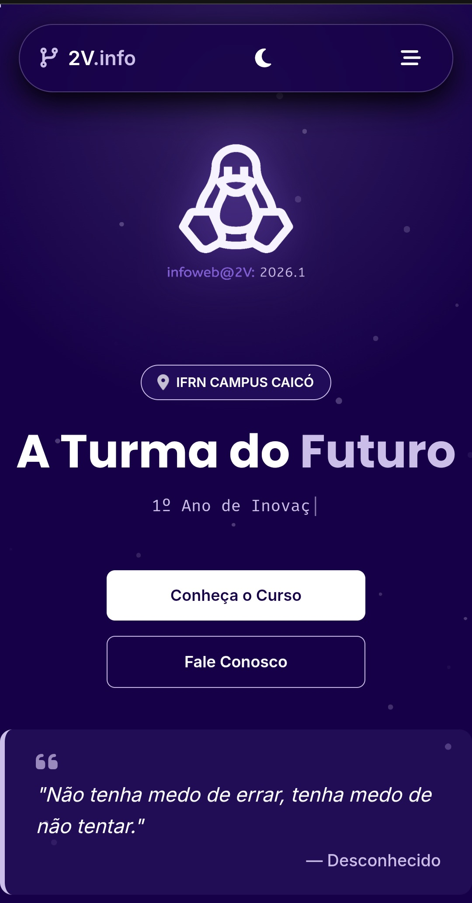

  
   
  <i>Desenvolvedor em formação | Entusiasta de Tecnologia & Game Dev | Estudante de TI no IFRN</i>

---

### 🚀 Sobre Mim

Olá! Sou o **Williams**, um desenvolvedor em constante evolução com uma paixão enorme por resolver problemas através do código. Atualmente, dedico meus estudos a compreender a base sólida da computação e do desenvolvimento de sistemas no **Instituto Federal do Rio Grande do Norte (IFRN)**.

* 🎓 **Formação:** Estudante de TI, com foco em dominar o ecossistema Web, Python e desenvolvimento de software.
* 🎮 **Game Dev:** Explorando a criação de jogos e experiências interativas utilizando **C#**, **Unity** e **Pygame**.
* 🐍 **Python Journey:** Aprofundando conhecimentos em lógica de programação, estruturas de dados e automação.
* 🌐 **Web Dev:** Construindo interfaces responsivas, semânticas e dinâmicas utilizando **HTML5, CSS3 e JavaScript**.
* 💡 **Objetivo:** Tornar-me um desenvolvedor versátil, capaz de criar soluções impactantes tanto para a Web quanto no entretenimento digital.

---

### 🛠️ Toolbox (Tecnologias e Ferramentas)

---

### 📊 Estatísticas do GitHub

---

### 📂 Projetos em Destaque

<table border="1" bordercolor="#30363d" style="border-collapse: collapse; width: 100%;">
  <tr>
    <td width="40%" align="center">
      
    </td>
    <td width="60%">
      <h3>💻 Portfólio da Turma 2V 2026</h3>
      
Desenvolvimento de um portfólio colaborativo feito inteiramente em <b>HTML, CSS e JavaScript (Vanilla)</b>. O projeto tem como objetivo exibir os trabalhos desenvolvidos pela nossa turma ao longo do curso.

      <a href="https://infoweb2026-2v.netlify.app/"><b>🔗 Acessar o Projeto Online</b></a>
    </td>
  </tr>
</table>

> 🚀 **Em breve:** Novos projetos focados em aplicações Web dinâmicas e **desenvolvimento de jogos**!

---

### 📫 Vamos Conversar?

Se quiser bater um papo sobre tecnologia, projetos ou trocar conhecimentos, sinta-se à vontade para me chamar:

  
  
  

 

  <i>"A única maneira de fazer um excelente trabalho é amar o que você faz." — Steve Jobs</i>

